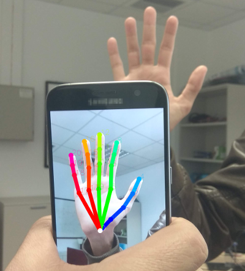

# Accurate Hand Keypoint Localization on Mobile Devices

Use the pretrained network of the paper "Accurate Hand Keypoints Localization on Mobile Devices" to extract hand joint heatmaps from RGB hand images.
The network is light enought (based on a mobilenet2 backend) to work on mobile phones. 

Download the paper from [here](http://users.ics.forth.gr/~argyros/mypapers/2019_05_MVA_hand2Dkeypoints.pdf).

## Requirements

Tested on **Python 3.x**. Required packages
- numpy
- tensorflow

## Usage

Clone the repo and run **joint_demo.py**.
